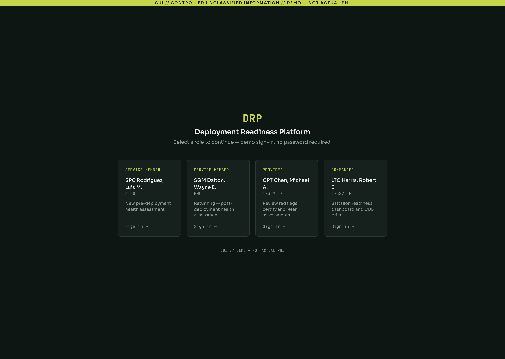
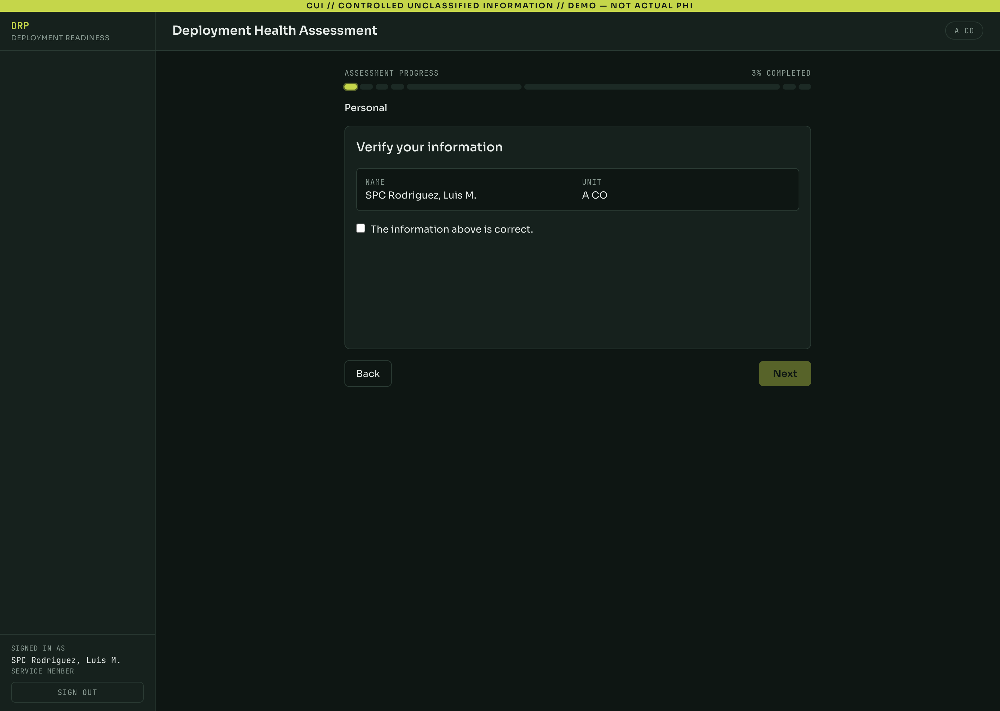
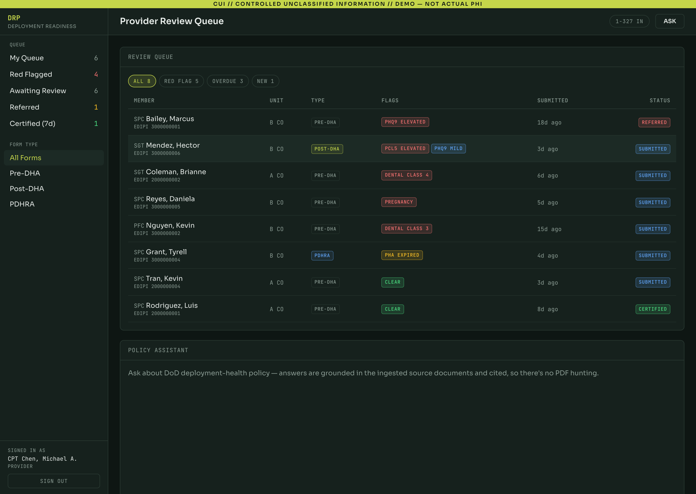
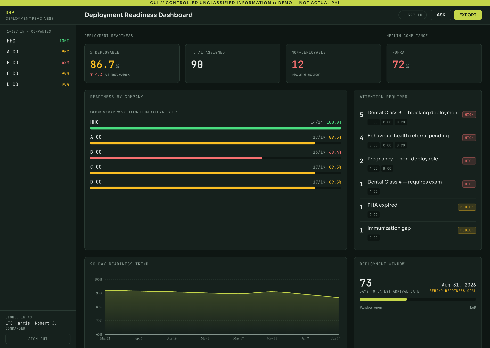

# Deployment Readiness Platform (DRP)

*Pronounced "durp"...because that's how deployment processing currently feels.*

## The Problem

Today, deployment processing burns an entire day...sometimes two. Service members start at 0-dark-30 and shuffle from station to station with paper forms no one can read. Eventually that paperwork reaches an S1 clerk and *maybe* makes it into a digital system. All the while, commanders need real-time readiness, but what they get are sporadic updates as NCOs chase down soldiers, only to find them stuck in the wrong line the whole time. Meanwhile, providers sift through hundreds of health assessments trying to confirm each member is mentally and physically ready to deploy. A lot gets missed. It shouldn't.

## The Solution

DRP is a unified pre- and post-deployment health assessment platform for military units. It digitizes the paper-based DD forms (2795, 2796, 2900) and the manual workflows around them — the EDHA web form, batched provider review, and Excel readiness roll-ups — into a single digital workflow connecting service members, medical providers, and commanders. DRP is a workflow and readiness-visibility layer, **not** a clinical system of record: it is designed to integrate with MHS Genesis (via FHIR), not replace it.

---

## What It Does

DRP brings all three roles into one digital workflow, each with a surface built for the job:

| Surface | Who Uses It | Purpose |
|---------|-------------|---------|
| **Service Member** | All personnel (enlisted + officers) | Submit pre/post-deployment health assessments (PHQ-9, PCL-5, dental, immunizations), upload documents, track status |
| **Medical Provider** | Physicians, PA/NPs | Review flagged assessments, certify or refer service members, consult policy assistant |
| **Commander** | Unit commanders | Real-time unit readiness KPIs, per-unit drill-down, 90-day trend, deployment window tracking, data-chat |

Key capabilities:
- **Auto-scoring** — PHQ-9 (depression) and PCL-5 (PTSD) screeners scored on submission
- **Rule-based red-flag engine** — dental class, behavioral health thresholds, pregnancy, immunization gaps, expired physical exams
- **Policy assistant** — RAG over uploaded policy PDFs; grounded Q&A with pgvector retrieval
- **Commander data-chat** — LLM-powered readiness queries with HIPAA guardrails (aggregates only, no names/medical details)
- **Automated notifications** — email on certify/refer decisions, PDHRA re-contact reminders via APScheduler

---

## Live Demo

**[View the live demo →](https://drp-warhacker.netlify.app/login)**

The demo is the real React frontend running entirely in your browser on seeded, **synthetic** data — no real personal or medical information, and no backend. Pick any of the four personas on the login screen to explore that surface:

| Persona | Surface | What to try |
|---------|---------|-------------|
| **Rodriguez** — Service Member | Pre-deployment | Complete a Pre-DHA questionnaire and watch it auto-score |
| **Dalton** — Service Member | Post-deployment | Complete a Post-DHA and see the pre→post comparison surface to the provider |
| **Chen** — Medical Provider | Provider review | Work the red-flag queue, open a detail drawer, certify/refer, ask the policy assistant |
| **Harris** — Commander | Commander dashboard | Readiness KPIs, per-company drill-down, trend chart, data-chat |

> **Demo vs. production:** to run with no backend, the demo's data and AI answers are canned fixtures. The live database, RAG policy assistant, commander data-chat, email, and authentication are all part of the full system — see [Beyond the Demo](#beyond-the-demo).

---

## Screenshots

| Persona login | Service Member — assessment |
|:---:|:---:|
|  |  |
| **Provider — review queue** | **Commander — readiness dashboard** |
|  |  |

---

## Beyond the Demo

The public demo is intentionally thin — a browser-only build on mock data. The production platform is a full-stack system built for the security posture a DoD medical workflow requires. None of the following is visible in the demo:

- **Real backend + database** — a Flask API over Supabase Postgres (with `pgvector`). In the demo the screens and chats are static fixtures; in production every assessment is scored, persisted, and rolled up live.
- **RAG policy assistant** — the provider's policy chat is grounded retrieval over actual uploaded policy PDFs (OpenAI embeddings + pgvector retrieval), not the canned answers the demo shows.
- **Commander data-chat** — real LLM queries over unit readiness data, gated by HIPAA guardrails that return category-level aggregates only — never names or medical specifics.
- **Identity & access** — production authenticates through **Keycloak** SSO fronted by **UDS Authservice**; your role and unit scope come from a verified identity, not a persona picker.
- **Notifications & scheduling** — SendGrid email on certify/refer decisions, plus APScheduler-driven PDHRA re-contact reminders.
- **Secure Kubernetes delivery (UDS)** — the real deployment ships as a **Zarf** package into **UDS Core** (Istio service mesh, tenant gateway, NetworkPolicies, and Pepr policy enforcement). It is built to install into airgapped / classified environments where a public host like Netlify could never run. That hardened delivery path is the whole point of the platform — and exactly what a "click around" demo can't convey.

For the full architecture, tech stack, local setup, API reference, testing, and the Docker/UDS/Kubernetes deployment, see **[DEVELOPMENT.md](DEVELOPMENT.md)**.

---

## Documentation

| Document | Contents |
|----------|----------|
| [DEVELOPMENT.md](DEVELOPMENT.md) | Architecture, tech stack, local setup, API reference, testing, production/UDS deployment |
| [docs/configuration.md](docs/configuration.md) | Full configuration reference |
| [docs/justifications.md](docs/justifications.md) | UDS policy exemptions with justification |
| [docs/DRP_SPEC.md](docs/DRP_SPEC.md) | Full project specification and DoD context |
