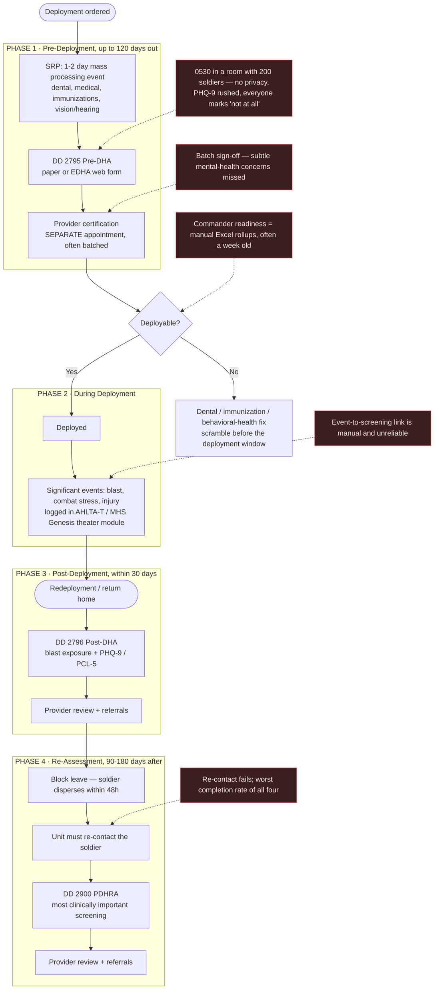
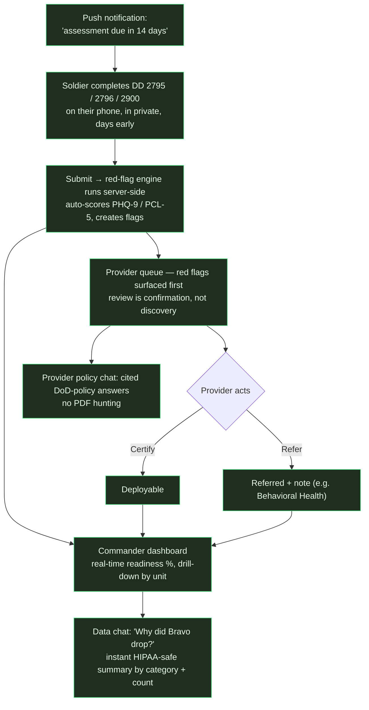

# Deployment Health Flow — Current State vs. DRP

For the team (especially the unicorns new to the domain): this is what a soldier
actually goes through today, where it breaks, and how DRP fixes each gap.
Source: `DRP_SPEC.md` §2. Acronyms at the bottom.

## The three forms (the legal backbone)

DoD Instruction **6490.03** mandates three deployment-health assessments:

| Form | What | When |
|---|---|---|
| **DD 2795** | Pre-Deployment Health Assessment (Pre-DHA) | ≤120 days before deploying |
| **DD 2796** | Post-Deployment Health Assessment (Post-DHA) | 30 days before → 30 days after return |
| **DD 2900** | Post-Deployment Health **Re**-Assessment (PDHRA) | 90–180 days after return |

Each form embeds **PHQ-9** (depression) and **PCL-5** (PTSD) screeners. A form
isn't "done" until a **provider certifies** it — a separate step from the
soldier filling it out. That gap is the core problem.

---

## Current flow (what actually happens)

### The pain, phase by phase
- **Phase 1 — Pre-Deployment:** The DD 2795 is filled out in a crowded room at
  0530. No privacy, so soldiers under-report on the PHQ-9 to avoid holding up
  the unit. Provider certification is a *separate, batched* review where subtle
  issues slip through. Dental Class 3/4 is the biggest blocker — not enough
  appointments before the window.
- **Phase 2 — During Deployment:** Concussive events / combat stress get logged
  in the theater EHR but don't reliably resurface at the post-deployment
  screening. (DRP v2 fixes this with event flagging — out of hackathon scope.)
- **Phase 3 — Post-Deployment:** Exhausted soldiers rush the DD 2796; referrals
  have poor follow-through because the soldier is on block leave in 48 hours.
- **Phase 4 — Re-Assessment (PDHRA):** The most important screening (PTSD often
  surfaces months later) has the *worst* completion rate — nobody's chasing a
  dispersed soldier for a form.
- **Throughout:** Commanders have no real-time readiness view; rollups are
  manual Excel produced by S1/UDM staff, often a week stale.

---

## DRP flow (the fix)

### Before → After

| Today | With DRP |
|---|---|
| Paper / EDHA form at 0530, no privacy | Phone, in private, days before SRP |
| PHQ-9 / PCL-5 hand-scored, errors | Auto-scored on submit |
| Red flags caught late, in batches | Flags fire the moment the form is submitted |
| Provider certification = discovery | Provider already reviewed → SRP is confirmation |
| Commander calls S1 for a week-old number | Real-time dashboard + drill-down |
| "Why did readiness drop?" = manual digging | Data chat answers in seconds (categories/counts) |
| PDHRA re-contact by phone, poor compliance | Auto push at 90 days; completion tracked as a metric |
| Provider guesses policy / searches PDFs | Policy chat with cited DoDI 6490.03 answers |

---

## What DRP replaces vs. what it doesn't

**Replaces:** paper forms, the EDHA web form, manual batch provider review,
Excel readiness rollups, phone calls for status, manual PDHRA re-contact.

**Does NOT replace:** the dental chair, the immunization station, the physical
exam, the legal briefing, AHLTA-Theater, MHS Genesis. **DRP is the workflow and
visibility layer — not the clinical system.** It's designed to later sync to
MHS Genesis via FHIR (see `DRP_SPEC.md` §6).

---

## Mini-glossary
- **SRP** — Soldier Readiness Processing; the mass pre-deployment processing event.
- **PHA** — Periodic Health Assessment; the annual physical (separate from these forms).
- **PHQ-9 / PCL-5** — depression / PTSD screeners embedded in the forms.
- **EDHA** — the current Navy-hosted web form for these assessments.
- **MHS Genesis** — the DoD's current EHR (Oracle Cerner). **AHLTA-T** = legacy theater EHR.
- **S1 / UDM** — battalion personnel staff / Unit Deployment Manager (do the manual rollups).
- **CUB** — Commander's Update Brief; where readiness gets reported up the chain.

Full glossary: `DRP_SPEC.md` §12.
